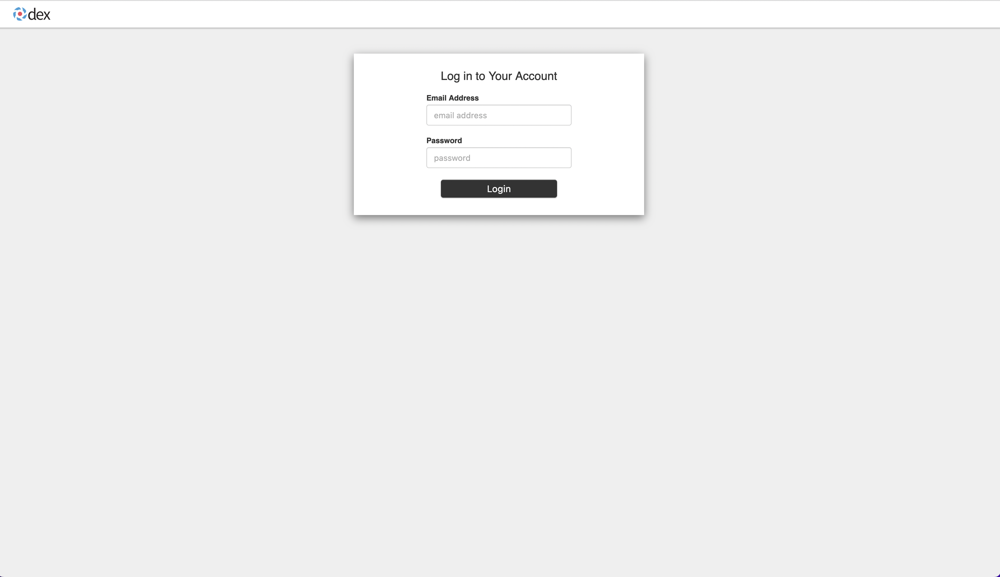

======================================
Install Kubeflow on vSphere with Tanzu
======================================

This document will guide you to install Kubeflow on vSphere with Tanzu.

We would show you the installation process of **Kubeflow 1.6.1**. Configurations may be slightly different for other versions.

-------------
Prerequisites
-------------

Adhere to the following requirements before deploying Kubeflow package on TKGS clusters.

For the deployment on vSphere with Tanzu (TKGS), Kubeflow will be installed on a Tanzu Kubernetes Cluster (TKC). So before the deployment of Kubeflow, you should get vSphere and TKC ready.

- For a greenfield deployment (no vSphere with Tanzu deployed on servers yet), you will need to deploy vSphere with Tanzu first. Please refer to VMware official document `vSphere with Tanzu Configuration and Management <https://docs.vmware.com/en/VMware-vSphere/7.0/vmware-vsphere-with-tanzu/GUID-152BE7D2-E227-4DAA-B527-557B564D9718.html>`__.

- With the proper vSphere with Tanzu installation and configuration, you will need to provison TKGS clusters. See `Workflow for Provisioning Tanzu Kubernetes Clusters Using the TKGS v1alpha2 API <https://docs.vmware.com/en/VMware-vSphere/7.0/vmware-vsphere-with-tanzu/GUID-3040E41B-8A54-4D23-8796-A123E7CAE3BA.html>`__.

- If you want to use GPU resources on vSphere platform, setup vGPU TKG with document `Deploy AI/ML Workloads on Tanzu Kubernetes Clusters <https://docs.vmware.com/en/VMware-vSphere/7.0/vmware-vsphere-with-tanzu/GUID-2B4CAE86-BAF4-4411-ABB1-D5F2E9EF0A3D.html>`__.

- Connect to the cluster from your client host. See `Connect to a Tanzu Kubernetes Cluster as a vCenter Single Sign-On User <https://docs.vmware.com/en/VMware-vSphere/7.0/vmware-vsphere-with-tanzu/GUID-AA3CA6DC-D4EE-47C3-94D9-53D680E43B60.html>`__

-----------
Preparation
-----------

^^^^^^^^^^^^^^^^^^^^^^^
Install Kapp-controller
^^^^^^^^^^^^^^^^^^^^^^^

The Carvel package manager "Kapp-controller" is shipped with unified TKG preinstalled. By running the following command, you should 
see a pod with a name starts with ``kapp-controller``.

.. code-block:: shell

	kubectl get pod -A | grep kapp-controller
	# example output:
	# tkg-system    kapp-controller-5b8579cb89-bkgps     2/2     Running   0          13d

Otherwise, you need to manually install Kapp-controller following :ref:`manually install kapp-controller`.

^^^^^^^^^^^^^^^^^
Install ``kctrl``
^^^^^^^^^^^^^^^^^

``kctrl`` is Kapp-controller’s native CLI and would be used to install Kubeflow Carvel Package.

Go to `our Kapp-controller release github <https://github.com/vmware-tanzu/carvel-kapp-controller/releases>`__, and install one 
release version.

Or run the following command to install it.

.. code-block:: shell

	export KCTRL_VERSION=v0.41.2

	echo "Installing kctrl..."
	dst_dir="/usr/local/bin"
	if [[ `uname` == Darwin ]]; then
		binary_type=darwin-amd64
	else
		binary_type=linux-amd64
	fi
	wget -O- github.com/vmware-tanzu/carvel-kapp-controller/releases/download/${KCTRL_VERSION}/kctrl-${binary_type} > /tmp/kctrl
	sudo mv /tmp/kctrl ${dst_dir}/kctrl
	chmod +x ${dst_dir}/kctrl
	echo "Installed ${dst_dir}/kctrl ${KCTRL_VERSION}"

----------------------------------------
Deploy Kubeflow Package on TKGS Clusters
----------------------------------------

.. note::
	In this guide, we would install Kubeflow 1.6.1. Configurations may be slightly different for other version.

^^^^^^^^^^^^^^^^^^^^^
Add PackageRepository
^^^^^^^^^^^^^^^^^^^^^

Creat namespace.

.. code-block:: shell

	kubectl create ns carvel-kubeflow-161-namespace
	kubectl config set-context --current --namespace=carvel-kubeflow-161-namespace

App package repository.

.. code-block:: shell

	kctrl package repository add \
		--repository kubeflow-carvel-repo \
		--url projects.registry.vmware.com/kubeflow/kubeflow-carvel-repo:1.6.1

You should see "Succeeded" message at the end of the output.

.. _values schema:

^^^^^^^^^^^^^^^^^^^^^^^^^^^^^^^^^^^^^^^
Create YAML file based on values schema
^^^^^^^^^^^^^^^^^^^^^^^^^^^^^^^^^^^^^^^

Run the command to print and view values schema of the Kubeflow package.

.. code-block:: shell

	kctrl package available get -p kubeflow.community.tanzu.vmware.com/1.6.1 --values-schema

The output should be similar to following:

.. code-block:: text

	Target cluster 'https://10.117.233.14:6443' (nodes: peach-ide-integration-control-plane-7lx72, 2+)

	Values schema for 'kubeflow.community.tanzu.vmware.com/1.6.1'

	Key                                  Default                                                                 Type     Description  
	CD_REGISTRATION_FLOW                 true                                                                    boolean  Turn on Registration Flow, so that Kubeflow Central Dashboard will prompt new users to create a namespace (profile)  
	Dex.config                           |-                                                                      string   Configuration file of Dex  
										issuer: http://dex.auth.svc.cluster.local:5556/dex                               
										storage:                                                                         
											type: kubernetes                                                               
											config:                                                                        
											inCluster: true                                                              
										web:                                                                             
											http: 0.0.0.0:5556                                                             
										logger:                                                                          
											level: "debug"                                                                 
											format: text                                                                   
										oauth2:                                                                          
											skipApprovalScreen: true                                                       
										enablePasswordDB: true                                                           
										staticPasswords:                                                                 
										- email: user@example.com                                                        
											hash: $2y$12$4K/VkmDd1q1Orb3xAt82zu8gk7Ad6ReFR4LCP9UeYE90NLiN9Df72             
											# https://github.com/dexidp/dex/pull/1601/commits                              
											# FIXME: Use hashFromEnv instead                                               
											username: user                                                                 
											userID: "15841185641784"                                                       
										staticClients:                                                                   
										# https://github.com/dexidp/dex/pull/1664                                        
										- idEnv: OIDC_CLIENT_ID                                                          
											redirectURIs: ["/login/oidc"]                                                  
											name: 'Dex Login Application'                                                  
											secretEnv: OIDC_CLIENT_SECRET                                                  
	Dex.use_external                     false                                                                   boolean  If set to True, the embedded Dex will not be created, and you will need to configure OIDC_Authservice with external IdP manually  
	IP_address                           ""                                                                      string   EXTERNAL_IP address of istio-ingressgateway, valid only if service_type is LoadBalancer  
	OIDC_Authservice.OIDC_AUTH_URL       /dex/auth                                                               string   AuthService will initiate an Authorization Code OIDC flow by hitting this URL. Normally discovered automatically through the OIDC Provider's well-known endpoint  
	OIDC_Authservice.OIDC_CLIENT_ID      kubeflow-oidc-authservice                                               string   AuthService will use this Client ID when it needs to contact your OIDC provider and initiate an OIDC flow  
	OIDC_Authservice.OIDC_CLIENT_SECRET  pUBnBOY80SnXgjibTYM9ZWNzY2xreNGQok                                      string   AuthService will use this Client Secret to authenticate itself against your OIDC provider in combination with CLIENT_ID when attempting to access your OIDC Provider's protected endpoints  
	OIDC_Authservice.OIDC_PROVIDER       http://dex.auth.svc.cluster.local:5556/dex                              string   URL to your OIDC provider. AuthService expects to find information about your OIDC provider at OIDC_PROVIDER/.well-known/openid-configuration, and will use this information to contact your OIDC provider and initiate an OIDC flow later on  
	OIDC_Authservice.OIDC_SCOPES         profile email groups                                                    string   Comma-separated list of scopes to request access to. The openid scope is always added.  
	OIDC_Authservice.REDIRECT_URL        /login/oidc                                                             string   AuthService will pass this URL to the OIDC provider when initiating an OIDC flow, so the OIDC provider knows where it needs to send the OIDC authorization code to. It defaults to AUTHSERVICE_URL_PREFIX/oidc/callback. This assumes that you have configured your API Gateway to pass all requests under a hostname to Authservice for authentication  
	OIDC_Authservice.SKIP_AUTH_URI       /dex                                                                    string   Comma-separated list of URL path-prefixes for which to bypass authentication. For example, if SKIP_AUTH_URL contains /my_app/ then requests to <url>/my_app/* are allowed without checking any credentials. Contains nothing by default  
	OIDC_Authservice.USERID_CLAIM        email                                                                   string   Claim whose value will be used as the userid (default email)  
	OIDC_Authservice.USERID_HEADER       kubeflow-userid                                                         string   Name of the header containing the user-id that will be added to the upstream request  
	OIDC_Authservice.USERID_PREFIX       ""                                                                      string   Prefix to add to the userid, which will be the value of the USERID_HEADER  
	imageswap_labels                     true                                                                    boolean  Add labels k8s.twr.io/imageswap: enabled to Kubeflow namespaces, which enable imageswap webhook to swap images.  
	service_type                         LoadBalancer                                                            string   Service type of istio-ingressgateway. Available options: "LoadBalancer" or "NodePort"  

	Succeeded

Create a ``values.yaml`` file according to above values schema. We would use this file in later Kubeflow installation.

.. code-block:: shell

	cat > values.yaml << 'EOF'

	imageswap_labels: True

	service_type: "LoadBalancer"

	IP_address: ""

	CD_REGISTRATION_FLOW: True

	OIDC_Authservice:
	OIDC_AUTH_URL: /dex/auth
	OIDC_PROVIDER: http://dex.auth.svc.cluster.local:5556/dex
	OIDC_SCOPES: "profile email groups"
	REDIRECT_URL: /login/oidc
	SKIP_AUTH_URI: "/dex"
	USERID_CLAIM: email
	USERID_HEADER: kubeflow-userid
	USERID_PREFIX: ""
	OIDC_CLIENT_ID: kubeflow-oidc-authservice
	OIDC_CLIENT_SECRET: pUBnBOY80SnXgjibTYM9ZWNzY2xreNGQok

	Dex:
	use_external: False
	config: |
		issuer: http://dex.auth.svc.cluster.local:5556/dex
		storage:
		type: kubernetes
		config:
			inCluster: true
		web:
		http: 0.0.0.0:5556
		logger:
		level: "debug"
		format: text
		oauth2:
		skipApprovalScreen: true
		enablePasswordDB: true
		staticPasswords:
		- email: user@example.com
		hash: $2y$12$4K/VkmDd1q1Orb3xAt82zu8gk7Ad6ReFR4LCP9UeYE90NLiN9Df72
		# https://github.com/dexidp/dex/pull/1601/commits
		# FIXME: Use hashFromEnv instead
		username: user
		userID: "15841185641784"
		staticClients:
		# https://github.com/dexidp/dex/pull/1664
		- idEnv: OIDC_CLIENT_ID
		redirectURIs: ["/login/oidc"]
		name: 'Dex Login Application'
		secretEnv: OIDC_CLIENT_SECRET

	EOF

^^^^^^^^^^^^^^^
Instal Kubeflow
^^^^^^^^^^^^^^^

Now, it's time for us to install Kubeflow 1.6.1 on vSphere!

.. code-block:: shell

	kctrl package install \
		--wait-check-interval 5s \
		--wait-timeout 30m0s \
		--package-install kubeflow \
		--package kubeflow.community.tanzu.vmware.com \
		--version 1.6.1 \
		--values-file values.yaml

Note that this may take some time, so please wait patiently.

You should see "Succeed" message at the end of the logs.

--------------------------
Access Kubeflow in browser
--------------------------

We can now move on to access Kubeflow in browser.

We first need to get the IP address of our Kubeflow. And there can be three cases:

**Option 1:** When you set ``service_type`` to ``LoadBalancer``, run the command below and visit ``EXTERNAL-IP`` of ``istio-ingressgateway``.

.. code-block:: shell

	kubectl get svc istio-ingressgateway -n istio-system
	# example output:
	# NAME                   TYPE           CLUSTER-IP       EXTERNAL-IP      PORT(S)                                                                      AGE
	# istio-ingressgateway   LoadBalancer   198.51.217.125   10.105.151.142   15021:31063/TCP,80:30926/TCP,443:31275/TCP,31400:30518/TCP,15443:31204/TCP   11d
	
	# in this exmpale output, you can access Kubeflow in browser using http://10.105.151.142:80

**Option 2:** When you set ``service_type`` to ``NodePort``, run the command below and visit ``nodeIP:nodePort``.

.. code-block:: shell

	kubectl get svc istio-ingressgateway -n istio-system
	# example output: 
	# (note that it has no external ip in this case)
	# NAME                   TYPE       CLUSTER-IP       EXTERNAL-IP   PORT(S)                                                                      AGE
	# istio-ingressgateway   NodePort   198.51.217.125   <none>        15021:31063/TCP,80:30926/TCP,443:31275/TCP,31400:30518/TCP,15443:31204/TCP   11d

	kubectl get nodes -o wide
	# example output:
	# NAME                                                      STATUS   ROLES                  AGE   VERSION            INTERNAL-IP     EXTERNAL-IP   OS-IMAGE             KERNEL-VERSION      CONTAINER-RUNTIME
	# v1a2-v1-23-8-tkc-v100-8c-dcpvc-4zct9                      Ready    control-plane,master   26d   v1.23.8+vmware.2   10.105.151.73   <none>        Ubuntu 20.04.4 LTS   5.4.0-124-generic   containerd://1.6.6
	# v1a2-v1-23-8-tkc-v100-8c-workers-zwfx4-77b7df85f7-f7f6f   Ready    <none>                 26d   v1.23.8+vmware.2   10.105.151.74   <none>        Ubuntu 20.04.4 LTS   5.4.0-124-generic   containerd://1.6.6
	# v1a2-v1-23-8-tkc-v100-8c-workers-zwfx4-77b7df85f7-l5mp5   Ready    <none>                 26d   v1.23.8+vmware.2   10.105.151.75   <none>        Ubuntu 20.04.4 LTS   5.4.0-124-generic   containerd://1.6.6

	# in this exmample, you can use any of below url:
	# http://10.105.151.73:30926
	# http://10.105.151.74:30926
	# http://10.105.151.75:30926

**Option 3:** Use ``port-forward``. Then visit the IP address of your client-side machine.

.. code-block:: shell

	# if you are running the command locally, you should visit http://localhost:8080

	kubectl port-forward -n istio-system svc/istio-ingressgateway --address 0.0.0.0 8080:80

We can then access Kubeflow in browser. You should arrive at the login page.

Login using the email address and password we configured in :ref:`values schema`.

.. code-block:: text
	Email: user@example.com
	Password: 12341234

For the first time you access Kubeflow in browser and login after installation, you would be asked to set a namespace.

You should then see the Kubeflow homepage.

---------------
Useful commands
---------------

To check PackageInstall Status:

.. code-block:: shell

	kubectl get PackageInstall kubeflow -o yaml

To print status of app created by package installation:

.. code-block:: shell

	kctrl package installed status --package-install kubeflow

To update values file:

.. code-block:: shell

	kctrl package installed update --package-install kubeflow --values-file values.yaml

Kapp-controller keeps reconciliating Kubeflow, which prevents you from editing a Kubeflow resource. In this case, you may want to 
pause or trigger the Kubeflow reconciliation.

To pause the reconciliation for a package installation:

.. code-block:: shell

	kctrl package installed pause --package-install kubeflow

To trigger the reconciliation of a package installation:

.. code-block:: shell

	kctrl package installed kick --package-install kubeflow --wait --wait-check-interval 5s --wait-timeout 30m0s

To uninstall a package, take ``kubeflow`` as an example:

.. code-block:: shell

	kctrl package installed delete --package-install kubeflow

More commands can be found in `Kapp-controller documentation <https://carvel.dev/kapp-controller/docs/v0.41.0/management-command/>`__.

---------------
Troubleshooting
---------------

^^^^^^^^^^^^^^^^^^^^^^^^^^^^^^^^^^^^^^^^^^^^^
Got stuck while deleting the Kubeflow Package
^^^^^^^^^^^^^^^^^^^^^^^^^^^^^^^^^^^^^^^^^^^^^

When deleting the Kubeflow package, some resources may get stuck at deleting status.

To solve this problem:

.. code-block:: shell

	# take namespace knative-serving as an example
	kubectl patch ns knative-serving -p '{"spec":{"finalizers":null}}'
	kubectl delete ns knative-serving --grace-period=0 --force

.. _manually install kapp-controller:

^^^^^^^^^^^^^^^^^^^^^^^^^^^^^^^^^^^^^^
Kapp-controller not running on cluster
^^^^^^^^^^^^^^^^^^^^^^^^^^^^^^^^^^^^^^

If you need to manually install Kapp-contoller, go to `this github <https://github.com/vmware-tanzu/carvel-kapp-controller/releases>`__ to install one release version.

Or run following command to install it:

.. code-block:: shell

	export KAPP_CONTROLLER_VERSION=v0.41.2

	cat << EOF | kubectl apply -f -
	---
	apiVersion: v1
	kind: Namespace
	metadata:
	name: kapp-controller
	---
	kind: RoleBinding
	apiVersion: rbac.authorization.k8s.io/v1
	metadata:
	name: rb-all-sa_ns-kapp-controller
	namespace: kapp-controller
	roleRef:
	kind: ClusterRole
	name: psp:vmware-system-privileged
	apiGroup: rbac.authorization.k8s.io
	subjects:
	- kind: Group
	apiGroup: rbac.authorization.k8s.io
	name: system:serviceaccounts:kapp-controller
	---
	EOF

	kubectl apply -f https://github.com/vmware-tanzu/carvel-kapp-controller/releases/download/${KAPP_CONTROLLER_VERSION}/release.yml

After installation, double check to confirm now "Kapp-controller" is running on your cluster. By running the following command, you should 
see a pod with a name starts with ``kapp-controller``.

.. code-block:: shell

	kubectl get pod -A | grep kapp-controller
	# example output:
	# tkg-system    kapp-controller-5b8579cb89-bkgps     2/2     Running   0          13d

.. seealso::

    `Get started with Charmed Kubeflow <https://charmed-kubeflow.io/docs/get-started-with-charmed-kubeflow>`_